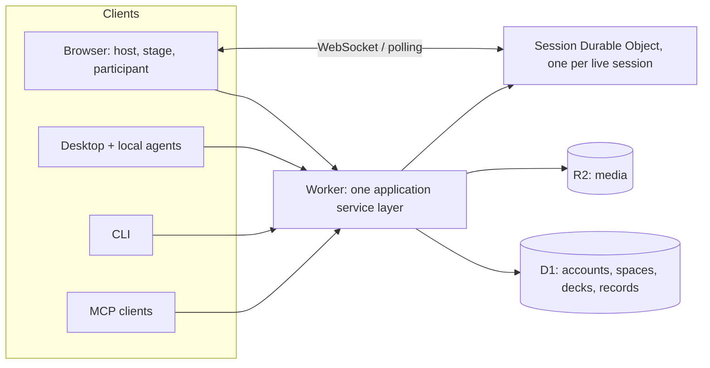

# OpenRoom

OpenRoom is a deck editor and live classroom in one. You write a deck, or have an
agent write it, press **Start**, and the room joins from their phones with a code.
Polls, quizzes, word clouds, rankings and Q&A run on the slide they belong to, and
the results animate on the projector. Tutors also get a workspace: who they teach,
notes after each lesson, and a private link where each student finds their
homework.

The hosted version is at **[openroom.app](https://openroom.app)**. This repository
is the whole application: Worker, browser apps, Desktop, CLI, MCP server and the
agent skills.

## A reference for AI-first desktop apps

OpenRoom was built to answer one question: what does an application look like when
agents are first-class users and not an add-on? The answers in this code base:

- **One service, many front doors.** The browser, the Electron Desktop app, the
  `openroom` CLI, the MCP server and the plain HTTP API call the same application
  services. There is no agent-only backend. The only browser-only steps are
  interactive sign-in and confirming a permanent deletion. `AGENTS.md` holds the
  rules that keep the surfaces in step.
- **The document is a schema.** A deck is a versioned, JSON-Schema-validated outline
  (`packages/schema`). Agents write it, `outline_validate` checks it, and the visual
  editor never shows the YAML. A `.openroom` file is a ZIP the teacher owns, like a
  PowerPoint file, with a deterministic three-way merge against the online copy.
- **Bring your own agent.** Desktop embeds the Claude and Codex harnesses and an
  API-key host, each running on the teacher's own subscription or key. OpenRoom
  hosts no model and resells no tokens. School documents stay on the teacher's
  computer; only the finished outline reaches the server.
- **Discoverable by machines.** `/llms.txt`, a generated OpenAPI document, an MCP
  server card, an A2A agent card, OAuth metadata for MCP clients, and installable
  skills under `plugin/` (prepare a lesson, port a deck, run a session).
- **The live plane is boring on purpose.** One Durable Object per session owns
  ballots and aggregates; clients use hibernating WebSockets with a polling
  fallback. Sessions forget by default: ballots 30 minutes after the end, the
  session itself after 24 hours.



Start with `docs/AGENT.md` (the agent contract), `docs/CONTRACTS.md` (shared types
and protocols), `docs/DESKTOP.md` (the native client and `.openroom` files) and
`docs/TUTORING.md` (the tutoring workflow). The end-user manual is served at
`/docs/`; its chapters are in `apps/site/src/content/docs/`.

## Layout

| Path | What |
| --- | --- |
| `packages/schema` | `Session` and `Outline` JSON Schemas, validators, YAML/JSON parsers, normalizers |
| `packages/domain` | Pure live-session state machine: commands, revisions, aggregates, blocklist, snapshots |
| `packages/sdk` | Tiny browser client (snapshot fetch, WS + polling fallback, command submit) |
| `packages/cli` | `openroom` CLI: init, validate, preview, `deck` and `session` control |
| `apps/worker` | Worker router + `SessionDO` Durable Object + static asset serving |
| `apps/participant` | Participant join app (`join.openroom.app`, also `/join/` locally) |
| `apps/stage` | Projector stage view (`/stage/`) — code + QR, animated live results |
| `apps/host` | Host console (`/host/`) — deck editor, tutor workspace and live controls |
| `apps/desktop` | Electron client — offline `.openroom` files, recovery, OS integration and external-display presentation |
| `apps/site` | Marketing/docs site (Astro) — landing (`/`), docs (`/docs/`), `llms.txt`, sitemap |
| `examples/` | Example decks (validated in CI) |
| `docs/journeys/` | Use-case contracts for UI consistency (stage / host / participant) |
| `e2e/` | Playwright journeys that enforce those contracts |

## Develop

```sh
bun install
bun run build       # all packages + apps
bun run test        # all unit/integration tests (vitest)
bun run typecheck
```

Start locally (after `bun run build`):

```sh
bun dev             # wrangler dev via portless — https://openroom.localhost (still :8787 underneath)
bun desktop         # worker on your LAN IP:8787 + Desktop (demo login; phones can join)
```

Same command from Cursor: NPM Scripts → `dev`, or Run and Debug → **OpenRoom: wrangler dev**.

### Named URLs (portless)

`bun dev` runs through [portless](https://portless.sh), which fronts the dev worker with a
stable hostname instead of `:8787`. Install it once and trust the CA (both proxy steps need sudo):

```sh
npm install -g portless
portless trust
portless proxy start
```

- `https://openroom.localhost` — apex (marketing, `/host/`, `/stage/`, `/api/`)
- `https://join.openroom.localhost` — participant SPA served at `/`, via a static alias
  (`portless alias join.openroom 8787`). This is the only local way to exercise the `join.*`
  hostname branch in `apps/worker/src/join-url.ts`.

In a linked git worktree the branch name is prepended: `https://fix-ui.openroom.localhost`.

`portless.json` pins the app port to 8787, so `http://localhost:8787`, `bun desktop` and the
Playwright journeys are unaffected. Two escape hatches:

```sh
bun run dev:worker   # wrangler dev directly, no portless needed
PORTLESS=0 bun dev   # same, through the portless CLI but bypassing the proxy
```

Because the port is pinned, a stale wrangler already holding 8787 makes the new one fall back to
8788 and the named URL 404s. `portless prune` clears orphans left by a crashed session.

Then open `/host/`, sign in with a demo account or enter the local operator key in Settings. Create a deck, or open a space at `/host/#/space/:id` for the tutor route. **Start session** on either kind opens the live controls and provides the stage and participant URLs.

Local sign-in (no Google needed): set `DEMO_AUTH=1` in `apps/worker/.dev.vars` (already in `.dev.vars.example`). Open Settings and pick a demo account — `alice` / `bob` / `cara`, password `demo`. That mints a real sign-in so the deck library and session recovery work.

### Browser journeys (Playwright)

With the worker started on port 8787:

```sh
bun run test:e2e    # docs/journeys contracts as Playwright specs
```

See `docs/journeys/README.md` for the document → test → iterate loop.

## Self-host

Everything runs on Cloudflare: Workers, Durable Objects, D1 and R2. Point the
`routes` and the D1 `database_id` in `apps/worker/wrangler.jsonc` at your own
account, then from the repo root:

```sh
wrangler login
bun run deploy
```

`bun run deploy` rebuilds every package and app before uploading. Required secrets:
`TOKEN_SECRET` (capability signing) and `ADMIN_KEY` (operator key), set with
`wrangler secret put <NAME>`. Google sign-in is optional (`GOOGLE_CLIENT_ID`,
`GOOGLE_CLIENT_SECRET`). Never set `DEMO_AUTH` in production.

A deployment without Paddle billing configured has every feature unlocked. The
hosted version is free for building decks and running classes, and charges for
shared spaces, saved results, and the loop around a class: Notes, homework,
learner links and identified sessions. The code is the same. Billing setup is in `docs/BILLING.md`, and CI deployment in
`docs/DEPLOYMENT.md`.

## License

The application is licensed under the [GNU AGPL v3](LICENSE). The client
libraries other programs build on, `packages/sdk`, `packages/schema` and
`packages/cli`, are [MIT](packages/sdk/LICENSE).

### Commercial licence and support

Organisations that cannot use AGPL software, or that want to self-host with a
support agreement, can license OpenRoom commercially. Write to
[hello@openroom.app](mailto:hello@openroom.app).

Contributions are accepted under the [Contributor License Agreement](CLA.md);
see [CONTRIBUTING.md](CONTRIBUTING.md).
