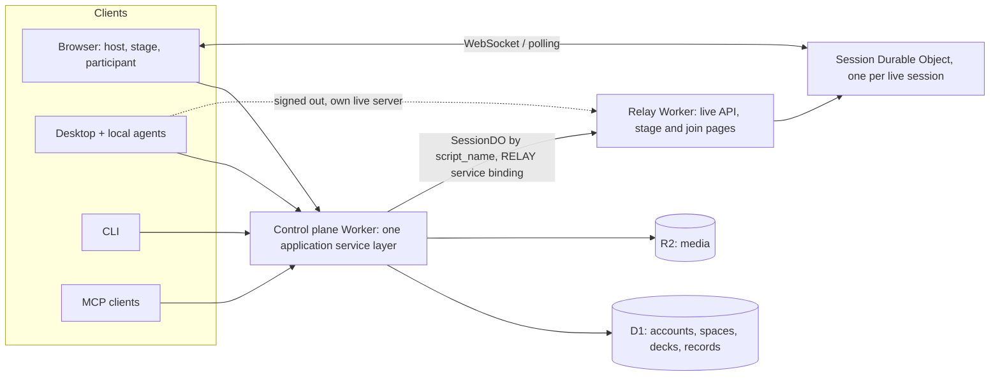

# OpenRoom

OpenRoom is a deck editor and live classroom in one. You write a deck, or have an
agent write it, press **Start**, and the room joins from their phones with a code.
Polls, quizzes, word clouds, rankings and Q&A run on the slide they belong to, and
the results animate on the projector. Tutors also get a workspace: who they teach,
notes after each lesson, and a private link where each student finds their
homework.

The hosted version is at **[openroom.app](https://openroom.app)**. This repository
is the whole application: the control-plane and relay Workers, browser apps,
Desktop, CLI, MCP server and the agent skills.

## A reference for AI-first desktop apps

OpenRoom was built to answer one question: what does an application look like when
agents are first-class users and not an add-on? The answers in this code base:

- **One service, many front doors.** The browser, the Electron Desktop app, the
  `openroom` CLI, the MCP server and the plain HTTP API call the same application
  services. There is no agent-only backend. The only browser-only steps are
  interactive sign-in and confirming a permanent deletion. `AGENTS.md` holds the
  rules that keep the surfaces in step.
- **The document is a schema.** A deck is a versioned, JSON-Schema-validated outline
  (`packages/schema`). Agents write it, `outline_validate` checks it, and the visual
  editor never shows the YAML. A `.openroom` file is a ZIP the teacher owns, like a
  PowerPoint file, with a deterministic three-way merge against the online copy.
- **Bring your own agent.** Desktop embeds the Claude and Codex harnesses and an
  API-key host, each running on the teacher's own subscription or key. OpenRoom
  hosts no model and resells no tokens. School documents stay on the teacher's
  computer; only the finished outline reaches the server.
- **Discoverable by machines.** `/llms.txt`, a generated OpenAPI document, an MCP
  server card, an A2A agent card, OAuth metadata for MCP clients, and installable
  skills under `plugin/` (prepare a lesson, port a deck, run a session).
- **The live plane is boring on purpose, and separable.** One Durable Object per
  session owns ballots and aggregates; clients use hibernating WebSockets with a
  polling fallback. Sessions forget by default: ballots 30 minutes after the end,
  the session itself after 24 hours. That object lives in its own Worker, the
  relay (`apps/relay`), which also runs on its own as a complete live system.



The full walkthrough, with diagrams of the agent sidebar, the MCP backends and a
traced "add a picture of a cat" request, is in
[`docs/ARCHITECTURE.md`](docs/ARCHITECTURE.md).

Start with `docs/AGENT.md` (the agent contract), `docs/CONTRACTS.md` (shared types
and protocols), `docs/DESKTOP.md` (the native client and `.openroom` files) and
`docs/TUTORING.md` (the tutoring workflow). The end-user manual is served at
`/docs/`; its chapters are in `apps/site/src/content/docs/`.

## Layout

| Path | What |
| --- | --- |
| `packages/schema` | `Session` and `Outline` JSON Schemas, validators, YAML/JSON parsers, normalizers |
| `packages/domain` | Pure live-session state machine: commands, revisions, aggregates, blocklist, snapshots |
| `packages/sdk` | Tiny browser client (snapshot fetch, WS + polling fallback, command submit) |
| `packages/cli` | `openroom` CLI: init, validate, preview, `deck` and `session` control |
| `apps/worker` | Control plane Worker: accounts, spaces, decks, billing, MCP, session creation; forwards live pages to the relay |
| `apps/relay` | Relay Worker: `SessionDO`, live session API and WebSocket, per-session assets, anonymous/pseudonymous join, stage and participant apps; runs alone with `RELAY_KEY` |
| `apps/participant` | Participant join app (`join.openroom.app`, also `/join/` locally) |
| `apps/stage` | Projector stage view (`/stage/`) — code + QR, animated live results |
| `packages/editor` | Deck editor, presenter and live console; reaches its host only through the `EditorServices` port |
| `packages/ui` | Shared shadcn primitives, toasts, theme provider and design tokens |
| `apps/host` | Host client (`/host/`) — workspace shell, Library, settings and the `EditorServices` adapters around `packages/editor` |
| `apps/desktop` | Electron client — offline `.openroom` files, recovery, OS integration and external-display presentation |
| `apps/site` | Marketing/docs site (Astro) — landing (`/`), docs (`/docs/`), `llms.txt`, sitemap |
| `examples/` | Example decks (validated in CI) |
| `docs/journeys/` | Use-case contracts for UI consistency (stage / host / participant) |
| `e2e/` | Playwright journeys that enforce those contracts |

## Develop

```sh
bun install
bun run build       # all packages + apps
bun run test        # all unit/integration tests (vitest)
bun run typecheck
```

Start locally (after `bun run build`):

```sh
bun dev             # wrangler dev via portless — https://openroom.localhost (still :8787 underneath)
bun desktop         # worker on your LAN IP:8787 + Desktop (demo login; phones can join)
```

Same command from Cursor: NPM Scripts → `dev`, or Run and Debug → **OpenRoom: wrangler dev**.

### Named URLs (portless)

`bun dev` runs through [portless](https://portless.sh), which fronts the dev worker with a
stable hostname instead of `:8787`. Install it once and trust the CA (both proxy steps need sudo):

```sh
npm install -g portless
portless trust
portless proxy start
```

- `https://openroom.localhost` — apex (marketing, `/host/`, `/stage/`, `/api/`)
- `https://join.openroom.localhost` — participant SPA served at `/`, via a static alias
  (`portless alias join.openroom 8787`). This is the only local way to exercise the `join.*`
  hostname branch in `apps/relay/src/join-url.ts`.

In a linked git worktree the branch name is prepended: `https://fix-ui.openroom.localhost`.

`portless.json` pins the app port to 8787, so `http://localhost:8787`, `bun desktop` and the
Playwright journeys are unaffected. Two escape hatches:

```sh
bun run dev:worker   # both Workers through wrangler dev directly, no portless needed
PORTLESS=0 bun dev   # same, through the portless CLI but bypassing the proxy
bun run dev:relay    # the relay alone on :8790 (RELAY_KEY=dev-relay in apps/relay/.dev.vars)
```

`bun dev` and `dev:worker` run both Workers as two `wrangler dev` processes
(`scripts/dev-workers.mjs`): the control plane on 8787, the relay on 8790. The control
plane reaches the relay through its bindings, connected by Wrangler's local dev registry. One
`wrangler dev -c … -c …` does not work: Miniflare backs both Workers' static assets with one
disk, so the relay would serve the control plane's files for `/stage/` and `/join/`. Copy `apps/relay/.dev.vars.example` to
`apps/relay/.dev.vars` next to the worker's; both need the same `TOKEN_SECRET`.

Because the port is pinned, a stale wrangler already holding 8787 makes the new one fall back to
8788 and the named URL 404s. `portless prune` clears orphans left by a crashed session.

Then open `/host/`, sign in with a demo account or enter the local operator key in Settings. Create a deck, or open a space at `/host/#/space/:id` for the tutor route. **Start session** on either kind opens the live controls and provides the stage and participant URLs.

Local sign-in (no Google needed): set `DEMO_AUTH=1` in `apps/worker/.dev.vars` (already in `.dev.vars.example`). Open Settings and pick a demo account — `alice` / `bob` / `cara`, password `demo`. That mints a real sign-in so the deck library and session recovery work.

### Browser journeys (Playwright)

With the worker started on port 8787:

```sh
bun run test:e2e    # docs/journeys contracts as Playwright specs
```

See `docs/journeys/README.md` for the document → test → iterate loop.

## Self-host

Everything runs on Cloudflare. There are two ways to host it.

### Relay only: live sessions, no accounts

The relay (`apps/relay`) is a complete live system on Workers and Durable Objects
alone: no D1, no R2, no sign-in. Whoever holds `RELAY_KEY` creates sessions;
participants join anonymously or with a pseudonymous handle on the relay's own join
page, and the stage runs there too. Identified and roster sessions need the full
deployment.

```sh
bun run build
cd apps/relay
# give it a public address: "workers_dev": true or a route in wrangler.jsonc
wrangler secret put TOKEN_SECRET
wrangler secret put RELAY_KEY
bun run deploy
```

Create a session with `POST /api/sessions` and `Authorization: Bearer <RELAY_KEY>`
(`docs/CONTRACTS.md`, "Relay API"), or point OpenRoom Desktop at it: Settings →
**Live server** (address + key). Signed out, Desktop then starts live sessions on
that relay.

### Full: workspace, library and live sessions

Point the `routes` and the D1 `database_id` in `apps/worker/wrangler.jsonc` at your
own account, then from the repo root:

```sh
wrangler login
bun run deploy
```

`bun run deploy` rebuilds every package and app, deploys the relay, then the control
plane, which binds the relay's `SessionDO` by script name and forwards `/join/`,
`/stage/` and the `join.` host to it. Required secrets: `TOKEN_SECRET` (capability
signing, the same value on both Workers) and `ADMIN_KEY` (operator key, control
plane), set with `wrangler secret put <NAME>`. The relay needs no `RELAY_KEY` here:
the control plane creates sessions. Google sign-in is optional (`GOOGLE_CLIENT_ID`,
`GOOGLE_CLIENT_SECRET`). Never set `DEMO_AUTH` in production.

A deployment without Paddle billing configured has every feature unlocked. The
hosted version is free for building decks and running classes, and charges for
shared spaces, saved results, sessions over 50 participants, and the loop around
a class: Notes, homework, learner links and identified sessions. The code is the same. Billing setup is in `docs/BILLING.md`, and CI deployment in
`docs/DEPLOYMENT.md`.

## License

The application is licensed under the [GNU AGPL v3](LICENSE). The client
libraries other programs build on, `packages/sdk`, `packages/schema` and
`packages/cli`, are [MIT](packages/sdk/LICENSE).

### Commercial licence and support

Organisations that cannot use AGPL software, or that want to self-host with a
support agreement, can license OpenRoom commercially. Write to
[hello@openroom.app](mailto:hello@openroom.app).

Contributions are accepted under the [Contributor License Agreement](CLA.md);
see [CONTRIBUTING.md](CONTRIBUTING.md).
