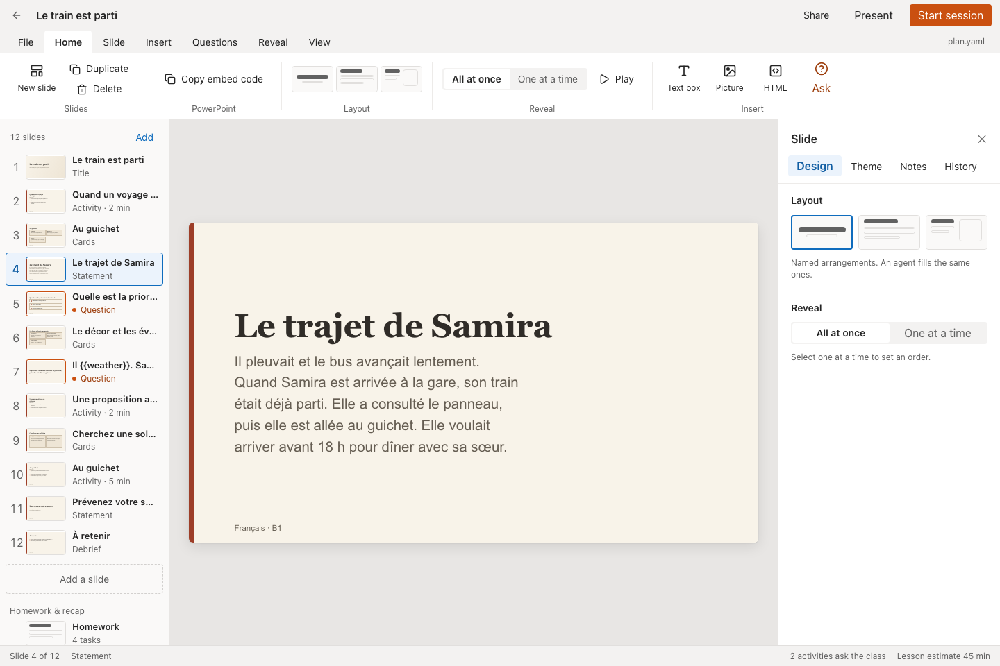
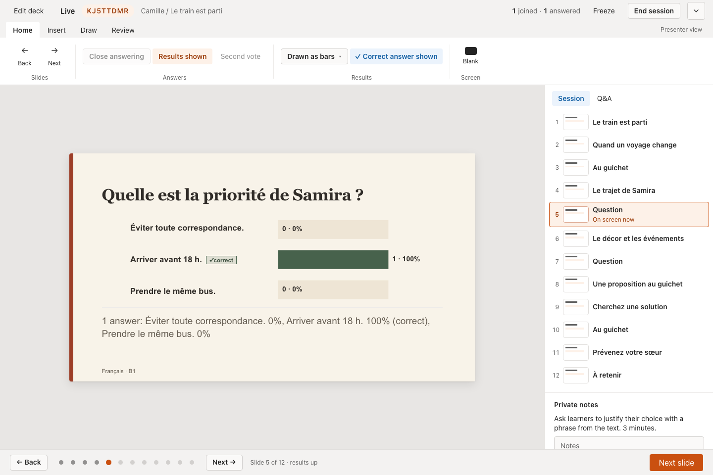
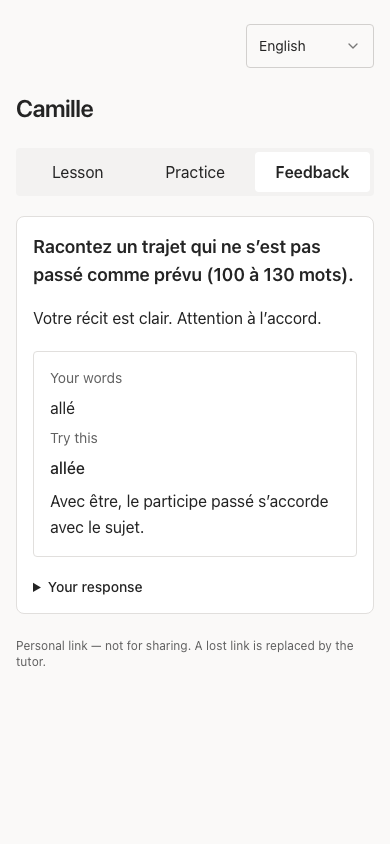

# OpenRoom

Slides and live audience interaction in one app, for teachers and tutors.

Build a lesson deck, press **Start**, and the class joins from their phones with a
short code. Polls, quizzes, word clouds, rankings and Q&A sit on the slides they
belong to, and results appear on the projector as people answer. Tutors also keep
lesson notes, set homework, and give each student a private link to their practice
and feedback.

[openroom.app](https://openroom.app) · [Manual](https://openroom.app/docs/) ·
[Architecture](docs/ARCHITECTURE.md) · [Self-host](docs/SELF-HOST.md)



## Features

- **Deck editor** with layouts, themes, reveal order, speaker notes and version
  history. Runs in the browser, or offline in the Desktop app on local `.openroom`
  files.
- **Live sessions**: phones join with a code or QR, no app or account needed. Polls,
  multiple choice, word clouds, rankings, open text, fill-the-gaps and moderated Q&A.
- **Presenter view** with answer controls, results shown as bars or clouds, and a
  second display for the stage.
- **Tutoring workflow**: students and classes, notes after each lesson, homework and
  practice, and a private learner page with returned work.
- **Agents built in**: the Desktop app has an agent sidebar that edits the open deck
  ("add a slide with a picture of a cat"). The same tools are available to any agent
  through the `openroom` CLI and an [MCP](https://modelcontextprotocol.io) server.
- **PowerPoint add-in** that puts OpenRoom questions and session controls inside
  PowerPoint.

| Live results | Learner feedback |
| --- | --- |
|  |  |

## Built with

[Cloudflare Workers](https://developers.cloudflare.com/workers/),
[Durable Objects](https://developers.cloudflare.com/durable-objects/) (one per live
session), [D1](https://developers.cloudflare.com/d1/) and
[R2](https://developers.cloudflare.com/r2/) on the server; React and
[Electron](https://www.electronjs.org) on the client; [Bun](https://bun.sh) for the
monorepo. [`docs/ARCHITECTURE.md`](docs/ARCHITECTURE.md) explains how the agent
sidebar, the CLI and the MCP server share one service layer.

## Getting started

```sh
bun install
bun run build
bun dev        # https://openroom.localhost via portless
bun desktop    # Desktop app, with phones on your network able to join
```

`bun dev` uses [portless](https://portless.sh) for named local URLs;
`bun run dev:worker` runs without it. Sign in locally with the demo account `alice` /
`demo`. Setup, demo accounts and browser tests are in
[`docs/DEVELOPMENT.md`](docs/DEVELOPMENT.md).

## Repository

| Path | |
| --- | --- |
| `packages/` | Schemas, live-session logic, editor, slide renderer, charts, UI kit, SDK, CLI, MCP server |
| `apps/desktop` | Electron app |
| `apps/relay` | Live-session Worker: session Durable Object, stage and participant pages |
| `apps/stage`, `apps/participant` | Projector view and phone app |
| `apps/office` | PowerPoint add-in |
| `apps/workspace`, `apps/workspace-worker` | Library, spaces, tutoring, billing; the control-plane Worker |
| `apps/site` | Website and manual |
| `plugin/` | Agent skills and MCP config |

## Self-hosting

OpenRoom deploys to your own Cloudflare account, either the relay alone for live
sessions without accounts, or the full app. A deployment without billing configured
has every feature unlocked. See [`docs/SELF-HOST.md`](docs/SELF-HOST.md).

## License

The core (`packages/`, the relay, stage, participant, Office and Desktop apps) is
[MIT](packages/sdk/LICENSE). The workspace (`apps/workspace`,
`apps/workspace-worker`, `apps/site`, `e2e/`) is [AGPL-3.0](LICENSE).
[`LICENSING.md`](LICENSING.md) maps every directory.

For a commercial licence or a support agreement, write to
[hello@openroom.app](mailto:hello@openroom.app). Contributions are welcome under the
[CLA](CLA.md); see [CONTRIBUTING.md](CONTRIBUTING.md).
