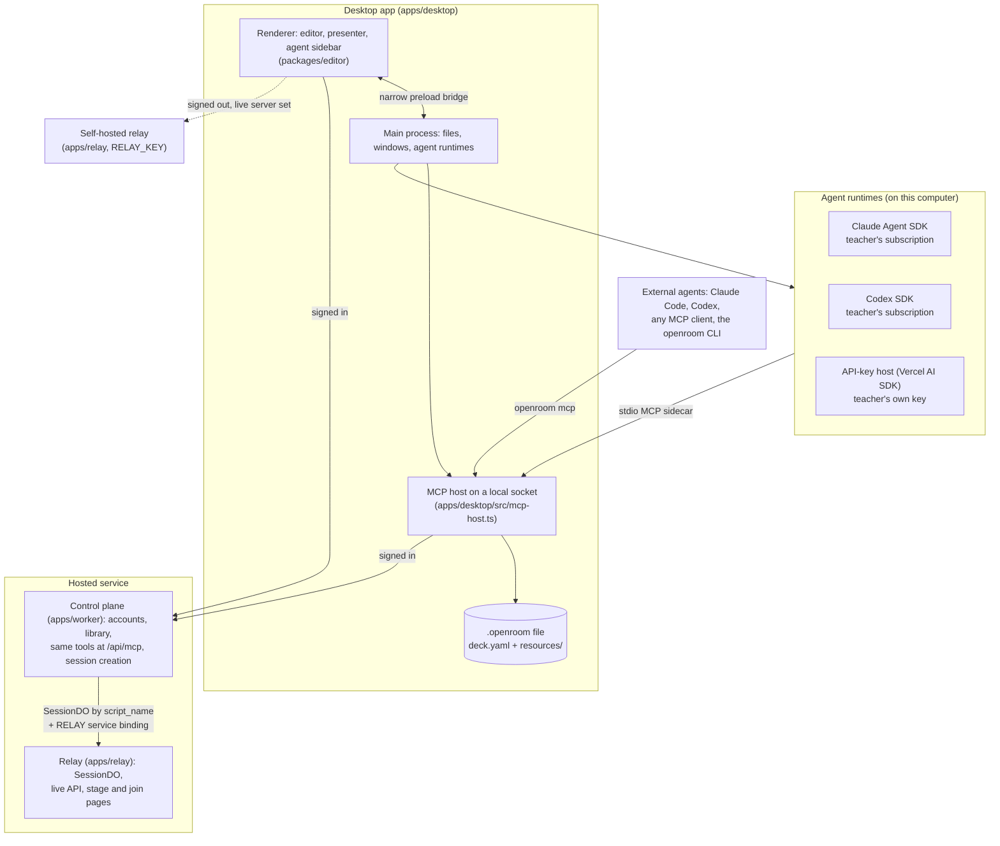
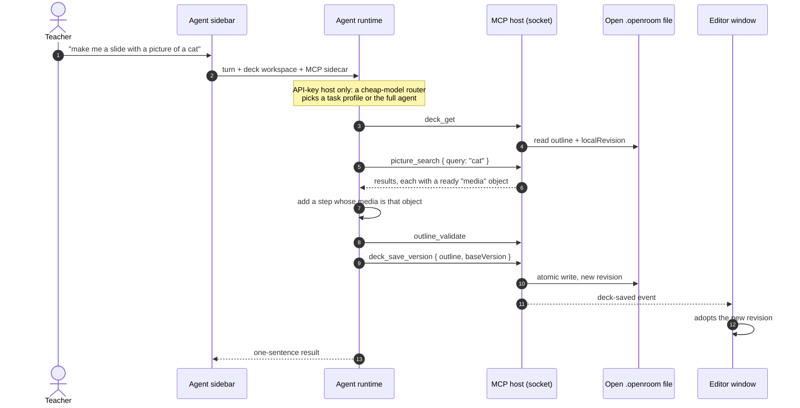
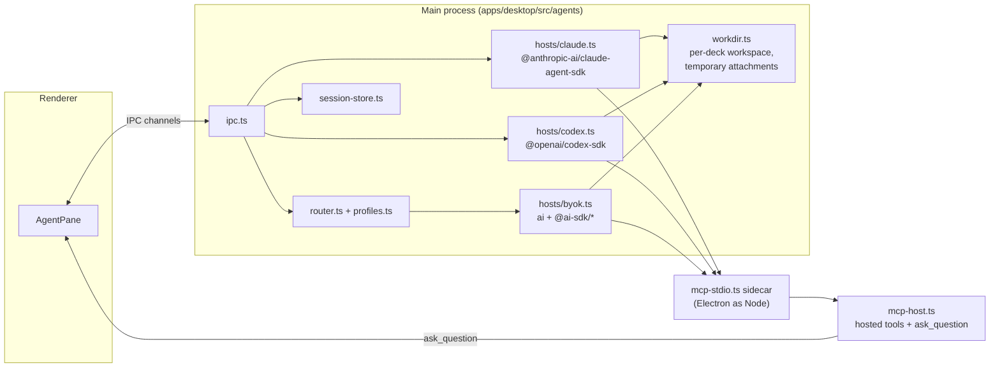
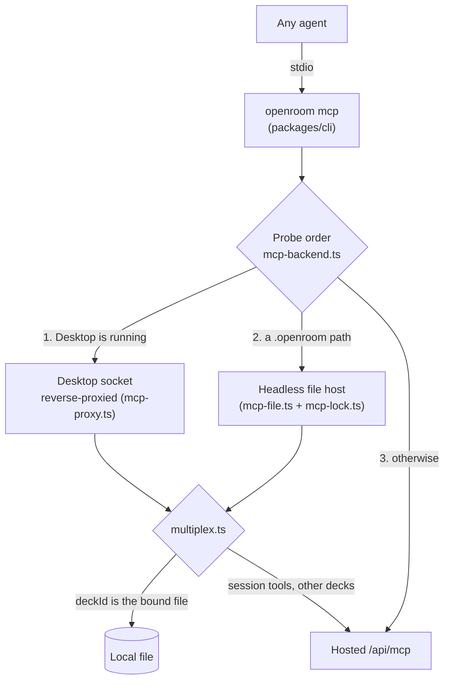
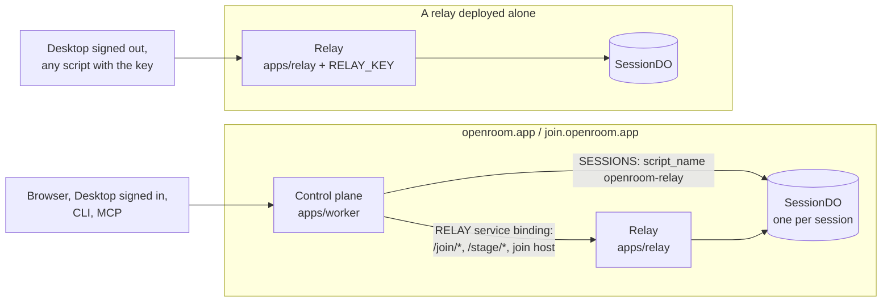

# Reference architecture: an AI-first desktop app

OpenRoom is a working example of a desktop application where agents are users, not
a feature bolted on. The core is a **hybrid desktop app**: an Electron shell that
edits local files and syncs them online, with three agent runtimes built in. You type
"make me a slide with a picture of a cat" into its sidebar, and a slide with a cat
appears in the open deck.

This document explains how that works and which parts you can copy. Paths are
relative to the repository root.

- [The shape](#the-shape)
- ["Make me a slide with a picture of a cat"](#make-me-a-slide-with-a-picture-of-a-cat)
- [The agent sidebar](#the-agent-sidebar)
- [MCP and CLI first](#mcp-and-cli-first)
- [The document is the contract](#the-document-is-the-contract)
- [Live sessions: control plane and relay](#live-sessions-control-plane-and-relay)
- [Paying for tokens: bring your own agent](#paying-for-tokens-bring-your-own-agent)
- [Trust boundaries](#trust-boundaries)
- [Discoverable by machines](#discoverable-by-machines)
- [Patterns to copy](#patterns-to-copy)

## The shape

The app works offline. A deck is a file the teacher owns, like a PowerPoint file.
Signing in adds the online library, sharing and live sessions. Signed out, a
teacher with a live server (their own relay) can still run anonymous and
pseudonymous live sessions. Agents never talk to the editor UI. They talk to the
same MCP tools as every other client, and the editor shows what they saved.

## "Make me a slide with a picture of a cat"

The teacher types the request into the sidebar of an open deck:

Why this "just works":

1. **The agent already knows the vocabulary.** The runtime starts in a per-deck
   workspace whose `AGENTS.md` brief and skills (`plugin/skills/`) explain the deck
   format and the tools. The sidebar never has to configure an MCP server; the
   sidecar is already connected to the open file. See
   `apps/desktop/src/agents/instructions.ts` and `workdir.ts`.
2. **Tools return finished values.** `picture_search` searches hosted stock photos and
   gives back a `media` object the agent pastes as-is. The agent never assembles a
   URL or a caption, and the photo credit is rendered from the URL. A cheap model
   only has to copy one value. See `packages/mcp/src/tools.ts`.
3. **The document is validated, not described.** The agent writes a typed outline
   (semantic steps, no coordinates, no CSS) and checks it with `outline_validate`
   before saving. The editor's layout engine decides how a picture step looks.
4. **Saves are revisions, and conflicts are answers.** `deck_save_version` takes the
   `baseVersion` the agent read. If the teacher edited the deck in the meantime, the
   save is refused with the latest revision, and the agent re-reads and re-applies.
   Nobody's work is overwritten.
5. **The editor adopts the result.** The MCP host broadcasts `deck-saved` to every
   window, and the editor showing that deck picks up the new revision
   (`apps/desktop/src/main.ts`, `onDeckSaved`). Saves from a separate Codex terminal
   reach the editor the same way.
6. **Small requests are cheap.** On the API-key host, a cheap-model router reads the
   request first. "Add a picture to slide 4" runs the `add-image` profile: a short
   static prompt, four tools, a cheap model and a six-step cap. A new slide is more
   than adding a picture, so that request runs on the full agent: either the router
   chooses it, or the profile calls `escalate` and hands the turn over. See
   [Paying for tokens](#paying-for-tokens-bring-your-own-agent).

## The agent sidebar

The sidebar (`packages/editor/src/agent/AgentPane.tsx`) is part of the editor, but
the agent runs in Desktop's main process. The browser app has no agent surface:
**Desktop is the only in-app agent chat** (`AGENTS.md`).

| Runtime | Library | Who pays | Conversation memory |
| --- | --- | --- | --- |
| Claude | `@anthropic-ai/claude-agent-sdk` | The teacher's Claude subscription. API keys are stripped from its environment so a stray key never bills instead. | Vendor session id, resumed per turn |
| Codex | `@openai/codex-sdk` | The teacher's ChatGPT subscription | Vendor thread id |
| API-key host | Vercel AI SDK (`ai`, `@ai-sdk/mcp`, providers for Anthropic, OpenAI, Google, Groq, Mistral and OpenAI-compatible endpoints such as Cloudflare Workers AI) | The teacher's own provider key, encrypted with the OS keychain | Replayed by `byok-history.ts` |

All three runtimes reach the deck through the **same MCP sidecar**. That is the trick
that keeps them interchangeable: tool access, approval and human questions are MCP
calls, not vendor-specific callbacks.

- **Human in the loop is a tool.** `ask_question` is a Desktop-only MCP tool. The
  runtime blocks on `tools/call` until the teacher answers in the sidebar, so it works
  the same way under all three runtimes (`apps/desktop/src/agents/ask-question.ts`).
- **The sidebar can narrow the tool list.** The sidecar can hide tools from a sidebar
  conversation by filtering `tools/list` and refusing calls to denied tools
  (`mcp-tool-filter.ts`).
- **Per-deck workspace, temporary attachments.** Each deck gets a persistent agent
  workspace and chat history. School files the teacher attaches are copied into a
  separate temporary area that is deleted when the conversation closes and swept on
  every launch. Referenced folders are read in place.
- **Resume after restart.** Vendor session and thread ids are stored with the chat,
  so a follow-up turn reconnects after the app reopens.

## MCP and CLI first

The tool surface came first; the GUI is one client of it. Browser, Desktop, CLI, MCP
and the HTTP API call the same application services. The only browser-only actions
are interactive sign-in and confirming a permanent deletion (`AGENTS.md`).

- **One MCP process, three backends.** `openroom mcp` connects to the running Desktop
  app if there is one, so an external agent edits the same open file the teacher is
  looking at. Without Desktop it binds a `.openroom` file directly; a lock file stops
  Desktop and the headless host from both writing. Otherwise it uses the hosted
  endpoint.
- **Files local, sessions hosted.** The multiplexer sends outline and deck tools to the
  bound file when the `deckId` is that file's id, and everything else to the hosted
  service. Starting a live session is never local.
- **Few typed tools, one general tool.** The typed tools cover the common path:
  `outline_validate`, `deck_get`, `deck_preview`, `deck_draft_put`,
  `deck_save_version`, `deck_start`, `picture_search`, and the `session_*` tools.
  `openroom_api` reaches the rest of the API catalog, so an agent never has to know
  route shapes. The full list is in `packages/mcp/src/tools.ts`.
- **One place documents a tool.** A tool's description is its documentation. If a fact
  about the surface is missing, it goes into the tool description, not into a skill
  or a doc (`AGENTS.md`).
- **The CLI is the same surface for scripts:** `openroom outline`, `deck`, `session`,
  `api`, `mcp` (`packages/cli/src/commands`).

## The document is the contract

- **A deck is a schema, not a canvas.** An `Outline v1` is a list of semantic steps
  (title, media, interactions, notes), validated by JSON Schema in `packages/schema`.
  Agents never send coordinates, CSS or HTML layout. Rendering is the editor's job
  (`packages/slides`), so any model, cheap or frontier, produces decks that look right.
- **The file is portable.** `.openroom` is a ZIP with a versioned `deck.yaml` manifest
  and resources under `resources/`. It has a stable `fileId`, a `localRevision` that
  advances on each atomic save, and a three-way merge against its online copy
  (`packages/schema/src/openroom-file.ts`, `docs/DESKTOP.md`).
- **Every write is conditional.** Agents and people save against the revision they
  read. A conflict returns the latest revision instead of overwriting it.

## Live sessions: control plane and relay

The live plane is its own Worker. `apps/relay` (`openroom-relay`) owns the
`SessionDO` class, one Durable Object per session, and serves everything a running
session needs: state, commands, the WebSocket, per-session assets (SQLite chunks in
the session's object), anonymous and pseudonymous joins, and the stage and
participant apps. It has no D1, no R2 and no accounts. `apps/worker` (`openroom`) is
the control plane: accounts, spaces, decks, billing, MCP and the API catalog.

**Hosted, the control plane creates every session.** `POST /api/sessions`,
`/api/sessions/:id/launch` and the MCP and CLI session tools run on the control plane: it
checks the account, the plan and the deck, then initialises the session object through
its cross-script `SESSIONS` binding (`script_name: "openroom-relay"`) and signs the
host and stage tokens with the shared `TOKEN_SECRET`. The control plane also answers
`/api/sessions/:code/*` and `/api/join` itself, so it can check that a connection is
still active, verify roster invites and learner links against D1, and archive a
session when it ends. The session logic it runs is the relay's own module
(`openroom-relay/live`) with a control-plane authority. The live pages
(`/join/`, `/stage/`, the `join.` host) are forwarded to the relay over the `RELAY`
service binding, so participant URLs are unchanged. The hosted relay has no public
route (`workers_dev: false`) and no `RELAY_KEY`; it never creates a session on its
own.

**On a relay deployed alone, the key creates sessions.** `POST /api/sessions` with
`Authorization: Bearer <RELAY_KEY>` and an outline returns the session code, host and
stage tokens and a join link on the relay. Identified and roster sessions are refused
(they need workspace records), as are identified joins; anonymous and pseudonymous
sessions run in full, with ballots export and no participant limit unless the request
sets `participantLimit`. Without `RELAY_KEY`, creation is off. The API is in
`docs/CONTRACTS.md`; deployment is in `docs/DEPLOYMENT.md`.

**Desktop picks the server when a session starts** (`apps/host/src/lib/desktop-live.ts`):

| State | Start live | Present |
| --- | --- | --- |
| Signed in | Control plane, as for every hosted deck | Offline |
| Signed out, live server set | The teacher's relay | Offline |
| Signed out, no live server | Off: "Live sessions need a sign-in or a live server." | Offline |

The live server (relay address and key) is set in Settings or from the document
window. The key is sealed with the OS keychain like the API-key host's keys, and only
the main process sends it, as the bearer of `POST /api/sessions` on that relay
(`apps/desktop/src/relay.ts`). The main process records each relay session's code, so
the `openroom://app/api/sessions/<code>/…` proxy sends that session's state, commands,
assets and exports to the relay. The editor does not branch on the server:
`RelayLiveServices` (`apps/host/src/editor-services.tsx`) narrows `EditorServices` for
the session, pointing join and stage links at the relay and dropping what the relay
does not hold (saved session record, saved results, remote and Q&A links for other
devices).

## Paying for tokens: bring your own agent

OpenRoom hosts no model, proxies no tokens and resells nothing. Every agent turn runs
on the teacher's computer, on a subscription they already have or a key they hold.

That makes cost the teacher's problem, so the API-key host is engineered to spend
little:

1. **A router picks the task profile** (`router.ts`). One cheap-model call reads the
   request and names the outcome. Anything uncertain falls back to the full agent:
   long requests, a provider with no cheap tier, an error or a timeout. Follow-up
   turns keep the profile they started under. The Claude and Codex runtimes ignore
   profiles.
2. **Profiles are small agents** (`profiles.ts`):

   | Profile | Tools | Model | Step cap |
   | --- | --- | --- | --- |
   | `add-image` | `picture_search`, `deck_get`, `deck_draft_put`, `deck_save_version` | cheap | 6 |
   | `add-exercise` | `deck_get`, `outline_validate`, `deck_draft_put`, `deck_save_version` | cheap | 8 |
   | `full` | all | the teacher's choice | 24 |

   Each profile has an `escalate` tool that hands the turn to the full agent.
3. **Prompt caching depends on identical bytes** (`cache-middleware.ts`). The prefix
   (tool schemas plus the system prompt) carries no per-user, per-machine or
   per-conversation bytes. Prompts are static constants and the tool block is ordered
   deterministically. Two cache breakpoints turn the repeated prefix into a cache
   read.

## Trust boundaries

- **The agent runs where the documents are.** School files stay on the teacher's
  computer. The hosted service stores only the finished outline, and agent
  workspaces and transcripts stay on the device.
- **Keys never leave the device.** An API key is encrypted with Electron
  `safeStorage`, passed to its provider as an explicit option, and never written into
  `process.env` or the sidecar's environment (`keys.ts`).
- **Irreversible actions need a person.** Normal deletion goes to a recoverable trash.
  Permanent deletion needs a short-lived confirmation in the browser and cannot be
  completed by CLI, MCP or an API token.
- **Credentials never convert.** Five credential families (browser session, personal
  token, live-session capability, learner link, roster invite) are each accepted only
  where they belong (`AGENTS.md`, "Credential boundary invariant").
- **The renderer is sandboxed.** It has context isolation, no Node integration and a
  narrow preload bridge (`apps/desktop/src/preload.ts`, `channels.ts`).
- **No model on the hot path.** Live voting runs on one Durable Object per session in
  the relay. No model call, D1, R2 or queue sits between a vote and its result.
- **A relay key stays in the main process.** The live server key is sealed with the
  OS keychain and never crosses the preload bridge (`apps/desktop/src/relay.ts`).

## Discoverable by machines

| Surface | Where |
| --- | --- |
| `llms.txt`, and Markdown versions of pages on `Accept: text/markdown` | site and Worker (`apps/worker/src/markdown-negotiation.ts`) |
| OpenAPI document, generated from the running app | `/openapi.json` (`apps/worker/src/api-catalog`) |
| MCP server card | `/.well-known/mcp/server-card.json` (`packages/mcp/src/server-card.ts`) |
| OAuth metadata for MCP clients | `/.well-known/oauth-protected-resource`, `/.well-known/oauth-authorization-server` |
| A2A agent card and JSON-RPC endpoint | `/.well-known/agent-card.json`, `/api/a2a` |
| WebMCP tools on the site | `apps/site/public/webmcp.js` |
| MCP Apps widget for deck previews | `packages/mcp/src/ui-resource.ts` |
| Installable skills | `plugin/skills/` |

## Patterns to copy

1. Build the tool surface first. Make the GUI one client of it, and keep the list of
   human-only actions short and deliberate.
2. Give agents a validated document format, not a canvas. Let the app do the layout.
3. Make every write conditional on a revision, and answer a conflict with the latest
   state.
4. Put all agent runtimes behind one local MCP endpoint, so tools, approvals and human
   questions work the same under every vendor.
5. Ask the human through a blocking tool call, not a vendor-specific callback.
6. Run the agent on the user's machine and subscription. Keep their documents local
   and their keys in the OS keychain.
7. If users pay per token, route small requests to small agents, and keep cached
   prefixes free of per-user bytes.
8. Keep models off the latency-critical path, and the live plane deployable on its
   own.
9. Publish machine-readable descriptions of everything: OpenAPI, MCP server card,
   agent card, `llms.txt`.
